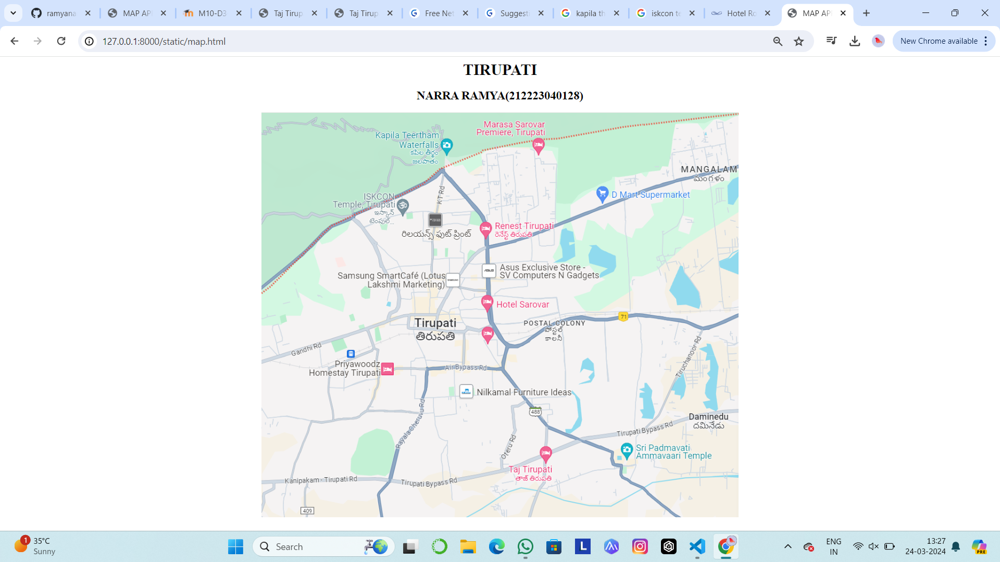
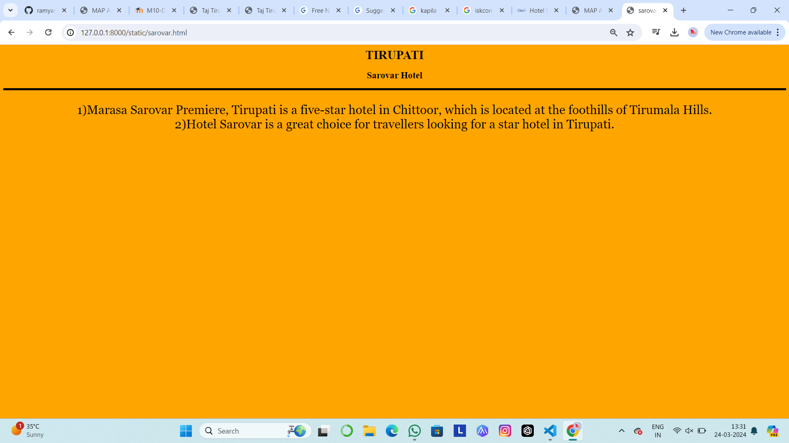
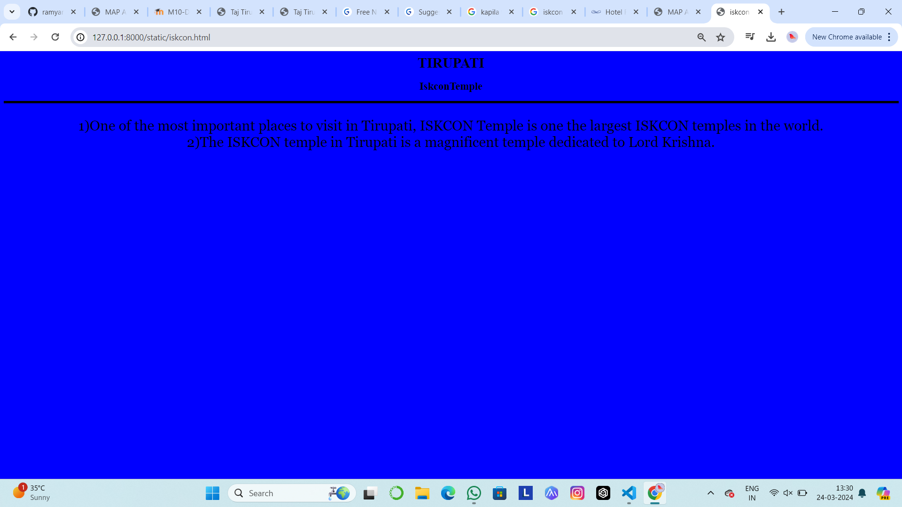
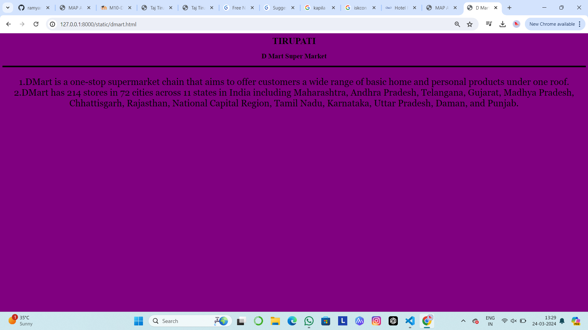
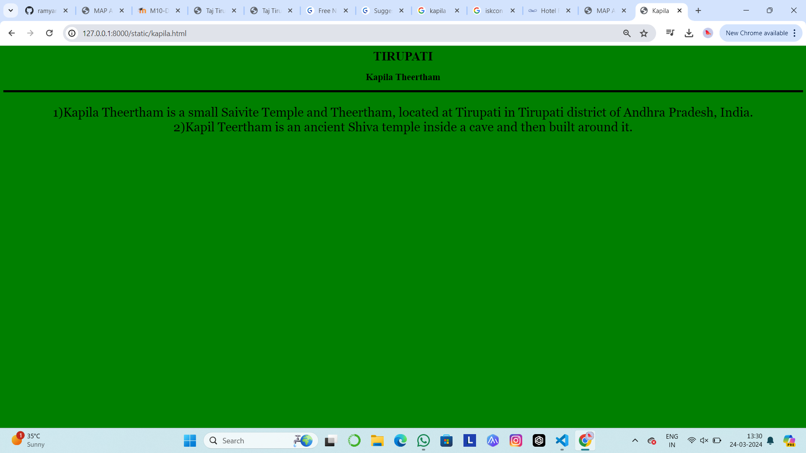
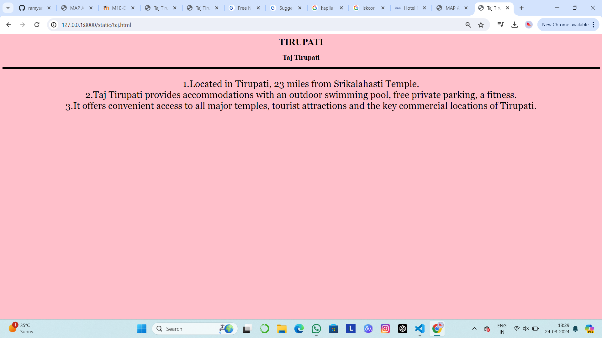

# Ex04 Places Around Me
## Date: 22/03/2024

## AIM
To develop a website to display details about the places around my house.

## DESIGN STEPS

### STEP 1
Create a Django admin interface.

### STEP 2
Download your city map from Google.

### STEP 3
Using ```<map>``` tag name the map.

### STEP 4
Create clickable regions in the image using ```<area>``` tag.

### STEP 5
Write HTML programs for all the regions identified.

### STEP 6
Execute the programs and publish them.

## CODE
# map.html
```
<html>
    <head>
        <title>MAP APP</title>
    </head>
    <body>
        <h1 align="center">TIRUPATI</h1>
        <h2 align="center">NARRA RAMYA(212223040128)</h2>
        <center>
            

<map name="image-map">
    <area target="" alt="taj tirupati" title="taj tirupati" href="taj.html" coords="577,739,586,703" shape="rect">
    <area target="" alt="d mart supermarket" title="d mart supermarket" href="dmart.html" coords="" shape="poly">
    <area target="" alt="kapila theertham" title="kapila theertham" href="kapila.html" coords="NaN" shape="circle">
    <area target="" alt="iskcon temple" title="iskcon temple" href="iskcon.html" coords="" shape="rect">
    <area target="" alt="sarovar hotel" title="sarovar hotel" href="sarovar.html" coords="" shape="poly">
</center>
</map>
    </body>
</html>
```
# sarovar.html
```
<html>
    <head>
        <title>sarovar hotel</title>
    </head>
    <body bgcolor="orange">
        <h1 align="center">TIRUPATI</h1>
        <h2 align="center"><b>Sarovar Hotel</b></h2>
        <hr size="5" color="black">
        <font face="Georgia" size="6">
        <p align="center">
            1)Marasa Sarovar Premiere, Tirupati is a five-star hotel in Chittoor, which is located at the foothills of Tirumala Hills. <br>
            2)Hotel Sarovar is a great choice for travellers looking for a star hotel in Tirupati.<br>
         
        </p> 
    </body>
</html>
```
# iskon.html
```
<html>
    <head>
        <title>iskcon temple</title>
    </head>
    <body bgcolor="blue">
        <h1 align="center">TIRUPATI</h1>
        <h2 align="center"><b>IskconTemple</b></h2>
        <hr size="5" color="black">
        <font face="Georgia" size="6">
        <p align="center">
            1)One of the most important places to visit in Tirupati, ISKCON Temple is one the largest ISKCON temples in the world. <br>
            2)The ISKCON temple in Tirupati is a magnificent temple dedicated to Lord Krishna.<br>
            
         
        </p> 
    </body>
</html>
```
# dmart.html
```<html>
    <head>
        <title>D Mart</title>
    </head>
    <body bgcolor="purple">
        <h1 align="center">TIRUPATI</h1>
        <h2 align="center"><b>D Mart Super Market</b></h2>
        <hr size="5" color="black">
        <font face="Georgia" size="6">
        <p align="center">
         1.DMart is a one-stop supermarket chain that aims to offer customers a wide range of basic home and personal products under one roof.
         <br>
         2.DMart has 214 stores in 72 cities across 11 states in India including Maharashtra, Andhra Pradesh, Telangana, Gujarat, Madhya Pradesh, Chhattisgarh, Rajasthan, National Capital Region, Tamil Nadu, Karnataka, Uttar Pradesh, Daman, and Punjab.
        </p> 
    </body>
</html>
```
# kapila.html
```<html>
    <head>
        <title>Kapila</title>
    </head>
    <body bgcolor="green">
        <h1 align="center">TIRUPATI</h1>
        <h2 align="center"><b>Kapila Theertham</b></h2>
        <hr size="5" color="black">
        <font face="Georgia" size="6">
        <p align="center">
            1)Kapila Theertham is a small Saivite Temple and Theertham, located at Tirupati in Tirupati district of Andhra Pradesh, India. <br>
            2)Kapil Teertham is an ancient Shiva temple inside a cave and then built around it.<br>
            
         
        </p> 
    </body>
</html>
```
# taj.html
```
<html>
    <head>
        <title>Taj Tirupati</title>
    </head>
    <body bgcolor="pink">
        <h1 align="center">TIRUPATI</h1>
        <h2 align="center"><b>Taj Tirupati</b></h2>
        <hr size="5" color="black">
        <font face="Georgia" size="6">
        <p align="center">
        1)Located in Tirupati, 23 miles from Srikalahasti Temple.
        <br>
        2)Taj Tirupati provides accommodations with an outdoor swimming pool, free private parking, a fitness.
        <br>
        3)It offers convenient access to all major temples, tourist attractions and the key commercial locations of Tirupati.
        </p> 
    </body>
</html>
```


## OUTPUT














## RESULT
The program for implementing image maps using HTML is executed successfully.
